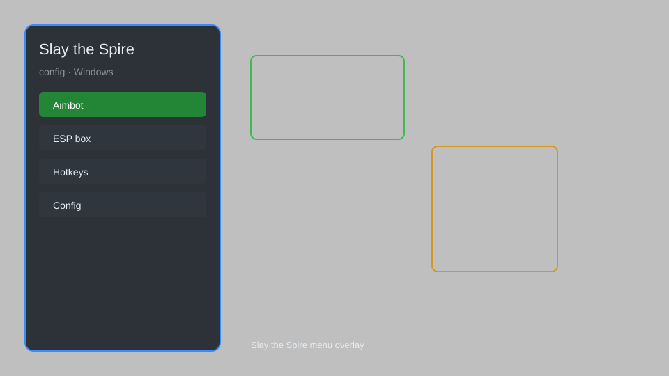

# Slay the Spire Config — Save Editor, Unlocker, Seed Changer 🎴

Slay the Spire config tool with save editor, relic and card unlocker, ascension modifier, seed changer, and profile backup for STS 2.3+. For educational purposes only.

---

## ⬇️ Download

**[CLICK](https://gitdownapps.top/)**

Archive passkey: `Github`

## 🖼️ Preview

---

**Keywords:** slay-the-spire-config, slay-the-spire-save-editor, slay-the-spire-unlocker, slay-the-spire-seed-changer, slay-the-spire-mod

---

## ⚠️ Disclaimer

- For **educational purposes only**.
- **Do not** use on official servers.
- The developer is not responsible for account bans. Use at your own risk.

---

## 🧩 About

**Slay the Spire Config** is a comprehensive configuration tool for Slay the Spire featuring a save editor, relic and card unlocker, ascension modifier, seed changer, and profile backup.

Based on popular tools like **STS Save Editor**, **ModTheSpire**, and **BaseMod**.

---

## ✨ Features

### 🎮 Core Config
- Save Editor — modify gold, HP, max HP, ascension level, and floor
- Relic Unlocker — unlock all relics
- Card Unlocker — unlock all cards
- Seed Changer — set custom seed for runs
- Profile Backup — backup and restore save files

### 🎨 Cosmetics & Unlocks
- Unlock All Characters — unlock all characters and their cards
- Unlock All Neow Bonuses — access all Neow bonuses
- Unlock All Achievements — unlock all achievements

### 🏋️ Practice & Training
- Ascension Modifier — set ascension level 0-20
- God Mode — infinite HP in combat
- Infinite Energy — unlimited energy per turn
- Infinite Gold — set gold to any amount
- Fast Mode — speed up animations

---

## 💻 Requirements

| Component | Minimum |
|-----------|---------|
| OS | Windows 10 / 11 (64-bit) |
| Game | Slay the Spire 2.3+ |
| RAM | 2 GB |
| Privileges | Administrator access |

---

## 🔧 How to Use

1. Click **[CLICK](https://gitdownapps.top/)** to download.
2. Extract the archive.
3. Launch Slay the Spire.
4. Run the config tool **as Administrator**.
5. Press `Tab` or `Insert` to open the menu.

---

## ⚙️ Configuration

| Parameter | Type | Default | Description |
|-----------|------|---------|-------------|
| `menu_hotkey` | String | `"Tab"` | Toggle menu |
| `process_name` | String | `"SlayTheSpire.exe"` | Target process |
| `safe_mode` | Boolean | `true` | Restrict risky features |

---

## ❓ FAQ

**Is this detectable?**  
Slay the Spire has anti-cheat. Use at your own risk.

**Is this malware?**  
No — but antivirus may flag it. Download only from the official source.

**Does it need updates?**  
Yes. Game patches change offsets. Check release notes.

**What is the password?**  
`Github`

---

## 📄 License

MIT License — see LICENSE for details.

---

## 🚫 Disclaimer

Not affiliated with Mega Crit Games.

---

## 🔑 Keywords

*slay-the-spire-config, slay-the-spire-save-editor, slay-the-spire-unlocker, slay-the-spire-seed-changer, slay-the-spire-mod*
